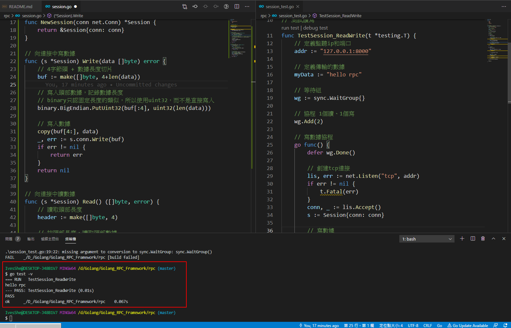

# Golang RPC Framework簡易實作
# RPC調用流程

- 微服務架構下數據交互一般是對內RPC，對外REST
- 將業務按功能模塊拆分到各自的微服務，具有提高項目協作效率、降低模塊耦合度、提高系統可用性等優點，但是開發門檻比較高，比如RPC框架的使用、後期服務監控等工作
- 一般情況下，會將功能代碼在本地直接調用，微服務架構下，我們需要將這個函數作為單獨的服務運行，客戶端通過網路調用

架構：對外REST，對內RPC


傳輸格式規劃


# session_test




# 實現RPC服務端

## 服務端接收到的數據需要包括

- 調用的函數名、函數列表
- 一般會約定函數的第二個返回值是error類型
- 通過反射實現

## 服務端需要解決的問題

- Client調用時只傳遞過來函數名，需要維護函數名到函數之類的map映射

## 服務端的核心功能

- 維護函數名到函數反射值的map
- client端傳函數名、參數列表後，服務端要解析為反射值，調用執行
- 函數的返回值打包，並通過網路返回給客戶端

# 實現RPC客戶端

- 客戶端只有函數原型，使用reflect.MakeFunc()可以完成原型到函數的調用
- reflect.MakeFunc()是Client以函數原型到網路調用的關鍵

# rpc_test


# session.go

```go
package rpc

import (
	"encoding/binary"
	"io"
	"net"
)

// 編寫會話中數據讀寫

// 會話連接的結構體
type Session struct {
	conn net.Conn
}

// 創建新連接
func NewSession(conn net.Conn) *Session {
	return &Session{conn: conn}
}

// 向連接中寫數據
func (s *Session) Write(data []byte) error {
	// 4字節頭 + 數據長度切片
	buf := make([]byte, 4+len(data))

	// 寫入頭部數據，記錄數據長度
	// binary只認固定長度的類似，所以使用uint32，而不是直接寫入
	binary.BigEndian.PutUint32(buf[:4], uint32(len(data)))

	// 寫入數據
	copy(buf[4:], data)
	_, err := s.conn.Write(buf)
	if err != nil {
		return err
	}
	return nil
}

// 向連接中讀數據
func (s *Session) Read() ([]byte, error) {
	// 讀取頭部長度
	header := make([]byte, 4)

	// 按頭部長度，讀取頭部數據
	_, err := io.ReadFull(s.conn, header)
	if err != nil {
		return nil, err
	}

	// 讀取數據長度
	dataLen := binary.BigEndian.Uint32(header)
	// 按照數據長度去讀取數據
	data := make([]byte, dataLen)
	_, err = io.ReadFull(s.conn, data)
	if err != nil {
		return nil, err
	}
	return data, nil
}

```

# session_test.go

```go
package rpc

import (
	"fmt"
	"net"
	"sync"
	"testing"
)

// 寫一個test程序

// 測試讀寫
func TestSession_ReadWrite(t *testing.T) {
	// 定義監聽ip和端口
	addr := "127.0.0.1:8000"

	// 定義傳輸的數據
	myData := "hello rpc"

	// 等待組
	wg := sync.WaitGroup{}

	// 協程 1個讀、1個寫
	wg.Add(2)

	// 寫數據協程
	go func() {
		defer wg.Done()

		// 創建tcp連接
		lis, err := net.Listen("tcp", addr)
		if err != nil {
			t.Fatal(err)
		}
		conn, _ := lis.Accept()
		s := Session{conn: conn}

		// 寫數據
		err = s.Write([]byte(myData))
		if err != nil {
			t.Fatal(err)
		}
	}()

	// 讀數據協程
	go func() {
		defer wg.Done()

		conn, err := net.Dial("tcp", addr)
		if err != nil {
			t.Fatal(err)
		}

		s := Session{conn: conn}

		// 讀數據
		data, err := s.Read()
		if err != nil {
			t.Fatal(err)
		}
		if string(data) != myData {
			t.Fatal(err)
		}
		fmt.Println(string(data))
	}()

	wg.Wait()
}

```

# codec.go

```go
package rpc

import (
	"bytes"
	"encoding/gob"
)

// 定義數據格式和編解碼

// 定義RPC交互的數據格式
type RPCData struct {
	// 訪問的函數
	Name string

	// 訪問時候的參數
	Args []interface{}
}

// 編碼
func encode(data RPCData) ([]byte, error) {
	var buf bytes.Buffer

	// 得到字節數組的編碼器
	bufEnc := gob.NewEncoder(&buf)

	// 對數據編碼
	if err := bufEnc.Encode(data); err != nil {
		return nil, err
	}
	return buf.Bytes(), nil
}

// 解碼
func decode(b []byte) (RPCData, error) {
	buf := bytes.NewBuffer(b)

	// 返回字節數組解碼器
	bufDec := gob.NewDecoder(buf)
	var data RPCData

	// 對數據解碼
	if err := bufDec.Decode(&data); err != nil {
		return data, err
	}

	return data, nil
}

```

# server.go

```go
package rpc

import (
	"fmt"
	"net"
	"reflect"
)

// 聲明服務端
type Server struct {
	// 地址
	addr string

	// 服務端維護的函數名到函數反射值的map
	funcs map[string]reflect.Value
}

// 創建服務端對象
func NewServer(addr string) *Server {
	return &Server{addr: addr, funcs: make(map[string]reflect.Value)}
}

// 服務端綁定註冊方法
// 將函數名與函數真正對應起來
// 第一個參數為函數名，第二個傳入真正函數
func (s *Server) Register(rpcName string, f interface{}) {
	if _, ok := s.funcs[rpcName]; ok {
		return
	}
	// map中沒有值，剛好映射添加進map，便於調用
	fVal := reflect.ValueOf(f)
	s.funcs[rpcName] = fVal
}

// 服務端等待調用
func (s *Server) Run() {
	// 監聽
	lis, err := net.Listen("tcp", s.addr)
	if err != nil {
		fmt.Printf("監聽 %s err: %v", s.addr, err)
		return
	}

	for {
		// 拿到連接
		conn, err := lis.Accept()
		if err != nil {
			fmt.Printf("accept err: %v", err)
			return
		}

		// 創建會話
		srvSession := NewSession(conn)

		// RPC讀取數據
		b, err := srvSession.Read()
		if err != nil {
			fmt.Printf("read err: %v", err)
			return
		}

		// 對數據解碼
		rpcData, err := decode(b)
		if err != nil {
			fmt.Printf("decode err: %v", err)
			return
		}

		// 根據讀取到的數據的Name，得到調用的函數名
		f, ok := s.funcs[rpcData.Name]
		if !ok {
			fmt.Printf("函數 %s 不存在", rpcData.Name)
			return
		}

		// 解析遍歷客戶端出來的參數，放到一個數組中
		inArgs := make([]reflect.Value, 0, len(rpcData.Args))
		for _, arg := range rpcData.Args {
			inArgs = append(inArgs, reflect.ValueOf(arg))
		}

		// 反射調用方法，傳入參數
		out := f.Call(inArgs)

		// 解析遍歷執行結果，放到一個數組中
		outArgs := make([]interface{}, 0, len(out))
		for _, o := range out {
			outArgs = append(outArgs, o.Interface())
		}

		// 包裝數據，返回給客戶端
		respRPCData := RPCData{rpcData.Name, outArgs}

		// 編碼
		respBytes, err := encode(respRPCData)
		if err != nil {
			fmt.Printf("encode err: %v", err)
			return
		}

		// 使用RPC寫出數據
		err = srvSession.Write(respBytes)
		if err != nil {
			fmt.Printf("session write err: %v", err)
			return
		}
	}
}

```

# client.go

```go
package rpc

import (
	"net"
	"reflect"
)

// 聲明客戶端
type Client struct {
	conn net.Conn
}

// 創建客戶端對象
func NewClient(conn net.Conn) *Client {
	return &Client{conn: conn}
}

// 實現通用的RPC客戶端
// 綁定RPC訪問的方法
// 傳入訪問的函數名

// 函數具體實現在Server端，Client只有函數原型
// 使用MakeFunc()完成原型到函數的調用

// fPtr指向函數原型
// xxx.callRPC("queryUser",&query)
func (c *Client) callRPC(rpcName string, fPtr interface{}) {
	// 通過反射，獲取fPtr未初始化的函數原型
	fn := reflect.ValueOf(fPtr).Elem()

	// 另一個函數，作用是對第一個函數參數操作
	// 完成與Server的交互
	f := func(args []reflect.Value) []reflect.Value {
		// 處理輸入的參數
		inArgs := make([]interface{}, 0, len(args))
		for _, arg := range args {
			inArgs = append(inArgs, arg.Interface())
		}

		// 創建連接
		cliSession := NewSession(c.conn)

		// 編碼數據
		reqRPC := RPCData{Name: rpcName, Args: inArgs}
		b, err := encode(reqRPC)
		if err != nil {
			panic(err)
		}

		// 寫出數據
		err = cliSession.Write(b)
		if err != nil {
			panic(err)
		}

		// 讀取響應數據
		respBytes, err := cliSession.Read()
		if err != nil {
			panic(err)
		}

		// 解碼數據
		respRPC, err := decode(respBytes)
		if err != nil {
			panic(err)
		}

		// 處理服務端返回的數據
		outArgs := make([]reflect.Value, 0, len(respRPC.Args))
		for i, arg := range respRPC.Args {
			// 必須進行nil轉換
			if arg == nil {
				// 必須填充一個真正的類型，不能是nil
				outArgs = append(outArgs, reflect.Zero(fn.Type().Out(i)))
				continue
			}
			outArgs = append(outArgs, reflect.ValueOf(arg))
		}
		return outArgs
	}
	// 參數1: 一個未初始化函數的方法值，類型是reflect.Type
	// 參數2: 另一個函數，作用是對第一個函數參數操作
	// 返回 reflect.Value類型
	// MakeFunc 使用傳入的函數原型，創建一個綁定 參數2 的新函數
	v := reflect.MakeFunc(fn.Type(), f)
	// 為函數fPtr賦值
	fn.Set(v)
}

```


